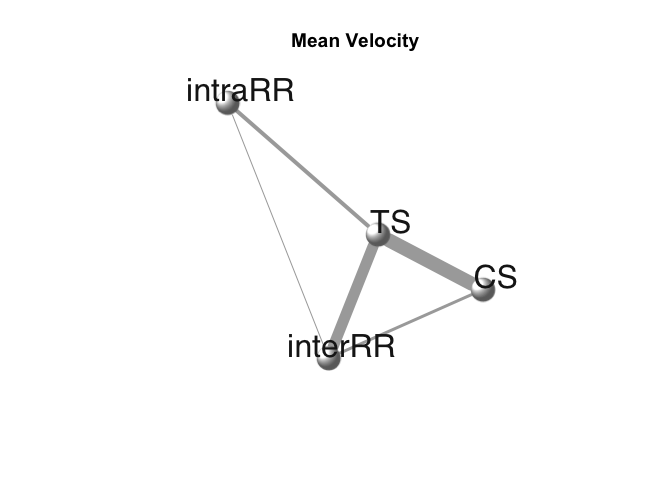
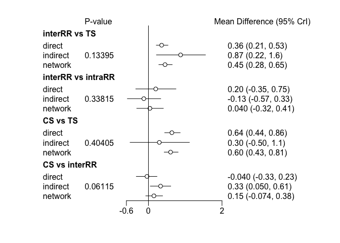
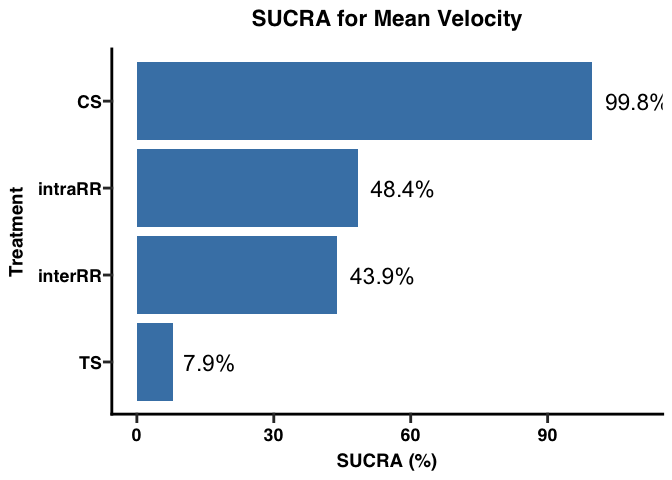
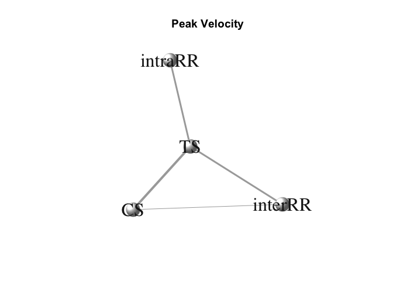
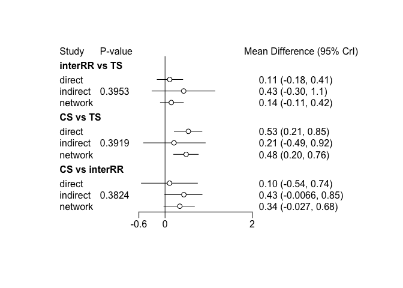
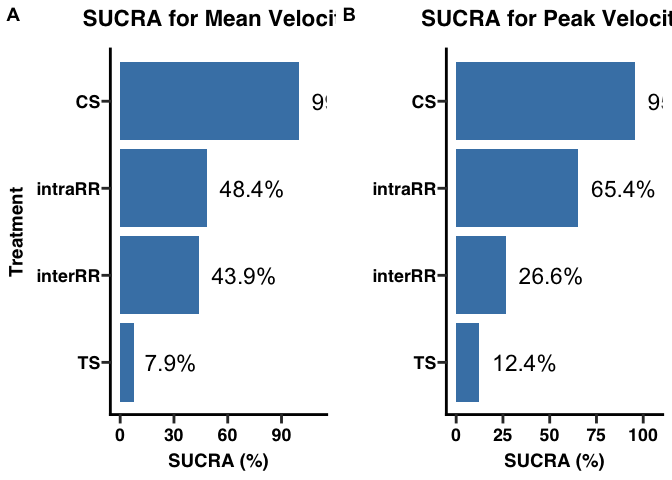
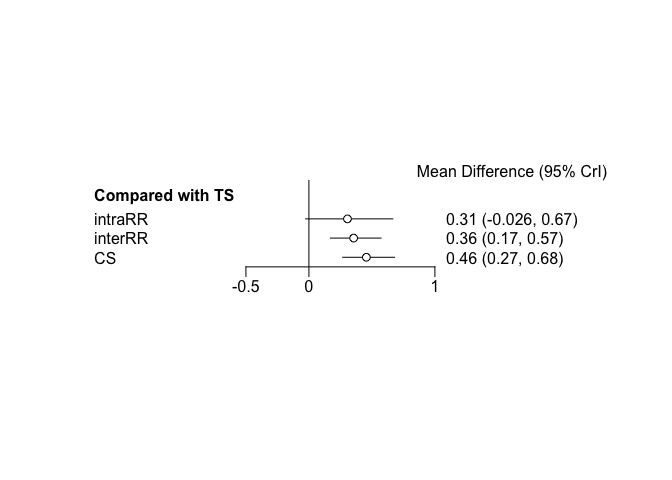
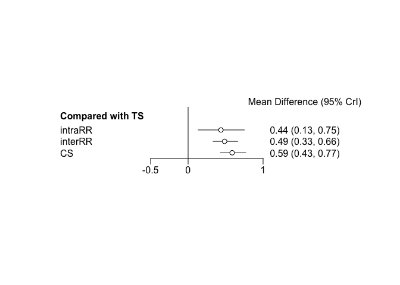
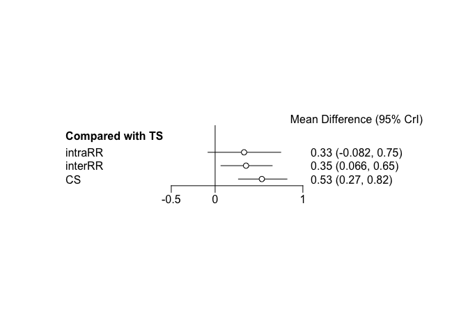

nma_sports_med
================
Yoshi Nagatani
2026-05-05

``` r
##### ----- Bayesian Network Meta-analysis: Mean Velocity (MV) ----- #####

###--------------------###
### Required libraries ###
###--------------------###
library(gemtc)
```

    ## Loading required package: coda

``` r
library(rjags)
```

    ## Linked to JAGS 4.3.2

    ## Loaded modules: basemod,bugs

``` r
library(dmetar)
```

    ## Extensive documentation for the dmetar package can be found at: 
    ##  www.bookdown.org/MathiasHarrer/Doing_Meta_Analysis_in_R/

    ## 
    ## Attaching package: 'dmetar'

    ## The following object is masked from 'package:gemtc':
    ## 
    ##     sucra

``` r
library(igraph)
```

    ## 
    ## Attaching package: 'igraph'

    ## The following objects are masked from 'package:stats':
    ## 
    ##     decompose, spectrum

    ## The following object is masked from 'package:base':
    ## 
    ##     union

``` r
library(dplyr)
```

    ## 
    ## Attaching package: 'dplyr'

    ## The following objects are masked from 'package:igraph':
    ## 
    ##     as_data_frame, groups, union

    ## The following objects are masked from 'package:stats':
    ## 
    ##     filter, lag

    ## The following objects are masked from 'package:base':
    ## 
    ##     intersect, setdiff, setequal, union

``` r
library(ggplot2)      
library(metafor)
```

    ## Loading required package: Matrix

    ## Loading required package: metadat

    ## Loading required package: numDeriv

    ## 
    ## Loading the 'metafor' package (version 5.0-1). For an
    ## introduction to the package please type: help(metafor)

    ## 
    ## Attaching package: 'metafor'

    ## The following object is masked from 'package:gemtc':
    ## 
    ##     forest

``` r
library(readxl)
library(ggprism)    
library(ggpubr)
```

    ## Registered S3 methods overwritten by 'broom':
    ##   method        from 
    ##   nobs.fitdistr MuMIn
    ##   nobs.multinom MuMIn

    ## Registered S3 method overwritten by 'car':
    ##   method           from
    ##   na.action.merMod lme4

``` r
set.seed(12345)  

###--------------------------------------------------###
### Adjust standard error (SE) for multi-arm studies ###
###--------------------------------------------------###
adjust_multiarm_se <- function(df, r = 0.5) {
  df %>%
    group_by(study) %>%
    mutate(
      std.err = if_else(
        is.na(diff) & n() > 2,
        {
          rel_ses <- std.err[!is.na(diff)]
          if (length(rel_ses) >= 2) {
            combs <- combn(rel_ses, 2)
            mean_cov <- mean(r * combs[1, ] * combs[2, ])
            sqrt(mean_cov)
          } else {
            min(std.err[!is.na(diff)], na.rm = TRUE) * 0.999
          }
        },
        std.err
      )
    ) %>%
    ungroup()
}


###------------------------###
### Mean Velocity Analysis ###
###------------------------###

# Load data
df_mv <- read_excel("SMD_SE_MV_positive.xlsx")
df_trt <- read_excel("Treatment.xlsx")

# Adjust SEs for multi-arm trials
df_mv <- adjust_multiarm_se(df_mv)

# Build network
network_mv <- mtc.network(data.re = df_mv, treatments = df_trt)
```

    ## Warning: Setting row names on a tibble is deprecated.

``` r
summary(network_mv)
```

    ## $Description
    ## [1] "MTC dataset: Network"
    ## 
    ## $`Studies per treatment`
    ##      TS intraRR interRR      CS 
    ##      26       4      12      15 
    ## 
    ## $`Number of n-arm studies`
    ## 2-arm 3-arm 
    ##    24     3 
    ## 
    ## $`Studies per treatment comparison`
    ##        t1      t2 nr
    ## 1 intraRR      TS  4
    ## 2 interRR      TS 11
    ## 3 interRR intraRR  1
    ## 4      CS      TS 14
    ## 5      CS interRR  3

``` r
# Network plot
plot(network_mv,
     use.description = TRUE,            
     vertex.color = "white",            
     vertex.label.color = "gray10",   
     vertex.shape = "sphere",           
     vertex.label.family = "Helvetica", 
     vertex.size = 20,                  
     vertex.label.dist = 2,             
     vertex.label.cex = 2,        
     layout = layout.fruchterman.reingold)
title("Mean Velocity")
```

<!-- -->

``` r
# Random-effects network meta-analysis model
model_mv <- mtc.model(network_mv,
                      likelihood = "normal",
                      link = "identity",
                      linearModel = "random",
                      n.chain = 4)

# MCMC sampling
mcmc_mv_short <- mtc.run(model_mv, n.adapt = 50, n.iter = 1000, thin = 10)
```

    ## Compiling model graph
    ##    Resolving undeclared variables
    ##    Allocating nodes
    ## Graph information:
    ##    Observed stochastic nodes: 27
    ##    Unobserved stochastic nodes: 34
    ##    Total graph size: 471
    ## 
    ## Initializing model

    ## Warning in rjags::jags.model(file.model, data = syntax[["data"]], inits =
    ## syntax[["inits"]], : Adaptation incomplete

    ## NOTE: Stopping adaptation

``` r
mcmc_mv       <- mtc.run(model_mv, n.adapt = 5000, n.iter = 1e5, thin = 10)
```

    ## Compiling model graph
    ##    Resolving undeclared variables
    ##    Allocating nodes
    ## Graph information:
    ##    Observed stochastic nodes: 27
    ##    Unobserved stochastic nodes: 34
    ##    Total graph size: 471
    ## 
    ## Initializing model

``` r
gelman.diag(mcmc_mv_short)$mpsrf
```

    ## [1] 1.017444

``` r
gelman.diag(mcmc_mv)$mpsrf
```

    ## [1] 1.000533

``` r
summary(mcmc_mv)
```

    ## 
    ## Results on the Mean Difference scale
    ## 
    ## Iterations = 5010:105000
    ## Thinning interval = 10 
    ## Number of chains = 4 
    ## Sample size per chain = 10000 
    ## 
    ## 1. Empirical mean and standard deviation for each variable,
    ##    plus standard error of the mean:
    ## 
    ##                Mean      SD  Naive SE Time-series SE
    ## d.TS.CS      0.6063 0.09643 0.0004822      0.0005539
    ## d.TS.interRR 0.4549 0.09166 0.0004583      0.0005004
    ## d.TS.intraRR 0.4132 0.16925 0.0008463      0.0008871
    ## sd.d         0.2271 0.07895 0.0003947      0.0007394
    ## 
    ## 2. Quantiles for each variable:
    ## 
    ##                 2.5%    25%    50%    75%  97.5%
    ## d.TS.CS      0.42756 0.5405 0.6024 0.6684 0.8071
    ## d.TS.interRR 0.28476 0.3932 0.4509 0.5127 0.6466
    ## d.TS.intraRR 0.08421 0.3007 0.4109 0.5227 0.7549
    ## sd.d         0.07446 0.1752 0.2247 0.2761 0.3916
    ## 
    ## -- Model fit (residual deviance):
    ## 
    ##     Dbar       pD      DIC 
    ## 33.33948 16.19677 49.53626 
    ## 
    ## 30 data points, ratio 1.111, I^2 = 13%

``` r
###------------------------------###
### Assessing global consistency ###
###------------------------------###

# Fit the inconsistency model - allowing unrelated mean effects (uncorrelated)
model_mv_incon <- mtc.model(network_mv,
                            likelihood = "normal",
                            link = "identity",
                            linearModel = "random",
                            n.chain = 4,
                            type = "use")

mcmc_mv_incon <- mtc.run(model_mv_incon,
                         n.adapt = 5000, n.iter = 1e5, thin = 10)
```

    ## Compiling model graph
    ##    Resolving undeclared variables
    ##    Allocating nodes
    ## Graph information:
    ##    Observed stochastic nodes: 27
    ##    Unobserved stochastic nodes: 30
    ##    Total graph size: 340
    ## 
    ## Initializing model

``` r
# Summaries
summary_consistent <- summary(mcmc_mv)
summary_inconsistent <- summary(mcmc_mv_incon)
summary_consistent
```

    ## 
    ## Results on the Mean Difference scale
    ## 
    ## Iterations = 5010:105000
    ## Thinning interval = 10 
    ## Number of chains = 4 
    ## Sample size per chain = 10000 
    ## 
    ## 1. Empirical mean and standard deviation for each variable,
    ##    plus standard error of the mean:
    ## 
    ##                Mean      SD  Naive SE Time-series SE
    ## d.TS.CS      0.6063 0.09643 0.0004822      0.0005539
    ## d.TS.interRR 0.4549 0.09166 0.0004583      0.0005004
    ## d.TS.intraRR 0.4132 0.16925 0.0008463      0.0008871
    ## sd.d         0.2271 0.07895 0.0003947      0.0007394
    ## 
    ## 2. Quantiles for each variable:
    ## 
    ##                 2.5%    25%    50%    75%  97.5%
    ## d.TS.CS      0.42756 0.5405 0.6024 0.6684 0.8071
    ## d.TS.interRR 0.28476 0.3932 0.4509 0.5127 0.6466
    ## d.TS.intraRR 0.08421 0.3007 0.4109 0.5227 0.7549
    ## sd.d         0.07446 0.1752 0.2247 0.2761 0.3916
    ## 
    ## -- Model fit (residual deviance):
    ## 
    ##     Dbar       pD      DIC 
    ## 33.33948 16.19677 49.53626 
    ## 
    ## 30 data points, ratio 1.111, I^2 = 13%

``` r
summary_inconsistent
```

    ## 
    ## Results on the Mean Difference scale
    ## 
    ## Iterations = 10:1e+05
    ## Thinning interval = 10 
    ## Number of chains = 4 
    ## Sample size per chain = 10000 
    ## 
    ## 1. Empirical mean and standard deviation for each variable,
    ##    plus standard error of the mean:
    ## 
    ##                 Mean     SD  Naive SE Time-series SE
    ## delta[1,2]   0.43750 0.1408 0.0007040      0.0007016
    ## delta[2,2]   0.74680 0.2320 0.0011598      0.0011598
    ## delta[3,2]   0.35521 0.1591 0.0007955      0.0007955
    ## delta[4,2]   1.23754 0.3469 0.0017343      0.0017344
    ## delta[5,2]   1.14433 0.4013 0.0020064      0.0020063
    ## delta[6,2]   0.07941 0.1614 0.0008069      0.0008306
    ## delta[7,2]   0.20876 0.1937 0.0009685      0.0009765
    ## delta[8,2]   0.48687 0.2662 0.0013308      0.0013374
    ## delta[9,2]   0.71157 0.3336 0.0016678      0.0016678
    ## delta[10,2]  0.75886 0.2535 0.0012674      0.0012568
    ## delta[11,2] -0.02420 0.2586 0.0012930      0.0012930
    ## delta[12,2]  0.55126 0.3607 0.0018035      0.0017962
    ## delta[13,2]  1.06660 0.3815 0.0019075      0.0019003
    ## delta[14,2]  0.61521 0.4045 0.0020227      0.0020043
    ## delta[15,2]  1.15588 0.3843 0.0019213      0.0018977
    ## delta[16,2]  0.80062 0.2153 0.0010765      0.0010765
    ## delta[17,2]  1.50067 0.3381 0.0016904      0.0016887
    ## delta[18,2]  0.44672 0.1672 0.0008361      0.0008361
    ## delta[19,2]  0.47512 0.2389 0.0011947      0.0011862
    ## delta[20,2]  0.41759 0.3333 0.0016663      0.0016929
    ## delta[21,2]  0.94864 0.2809 0.0014047      0.0013950
    ## delta[22,2]  0.13986 0.2775 0.0013873      0.0013805
    ## delta[23,2]  0.79232 0.3221 0.0016105      0.0015993
    ## delta[24,2]  0.67315 0.3045 0.0015225      0.0015225
    ## delta[25,2]  0.25120 0.1436 0.0007178      0.0007156
    ## delta[25,3]  0.28656 0.1425 0.0007126      0.0007177
    ## delta[26,2]  0.31200 0.1432 0.0007161      0.0007176
    ## delta[26,3]  0.22495 0.1411 0.0007055      0.0007055
    ## delta[27,2] -0.01136 0.2162 0.0010808      0.0010774
    ## delta[27,3]  0.18494 0.2170 0.0010852      0.0010765
    ## 
    ## 2. Quantiles for each variable:
    ## 
    ##                  2.5%      25%      50%    75%  97.5%
    ## delta[1,2]   0.159614  0.34286  0.43824 0.5329 0.7131
    ## delta[2,2]   0.288214  0.59127  0.74767 0.9020 1.2044
    ## delta[3,2]   0.041651  0.24850  0.35566 0.4629 0.6646
    ## delta[4,2]   0.562487  1.00201  1.23707 1.4699 1.9188
    ## delta[5,2]   0.358675  0.87575  1.14298 1.4158 1.9362
    ## delta[6,2]  -0.233830 -0.02929  0.07833 0.1861 0.3987
    ## delta[7,2]  -0.170595  0.07856  0.20914 0.3390 0.5886
    ## delta[8,2]  -0.031220  0.30762  0.48636 0.6661 1.0094
    ## delta[9,2]   0.058482  0.48585  0.71072 0.9354 1.3645
    ## delta[10,2]  0.262158  0.58752  0.76087 0.9299 1.2557
    ## delta[11,2] -0.525493 -0.20160 -0.02375 0.1493 0.4844
    ## delta[12,2] -0.153787  0.30752  0.55053 0.7971 1.2551
    ## delta[13,2]  0.317716  0.81219  1.06732 1.3210 1.8140
    ## delta[14,2] -0.163237  0.33996  0.61309 0.8889 1.4113
    ## delta[15,2]  0.407228  0.89523  1.15561 1.4152 1.9095
    ## delta[16,2]  0.379179  0.65454  0.80190 0.9457 1.2224
    ## delta[17,2]  0.836953  1.27391  1.50031 1.7303 2.1582
    ## delta[18,2]  0.116202  0.33485  0.44760 0.5595 0.7747
    ## delta[19,2]  0.007883  0.31370  0.47569 0.6366 0.9425
    ## delta[20,2] -0.231909  0.19168  0.41614 0.6432 1.0713
    ## delta[21,2]  0.399247  0.75816  0.94859 1.1382 1.4957
    ## delta[22,2] -0.401946 -0.04631  0.13988 0.3236 0.6895
    ## delta[23,2]  0.157299  0.57632  0.79043 1.0100 1.4250
    ## delta[24,2]  0.075997  0.46829  0.67268 0.8763 1.2743
    ## delta[25,2] -0.029978  0.15372  0.25130 0.3474 0.5355
    ## delta[25,3]  0.008500  0.19002  0.28648 0.3818 0.5673
    ## delta[26,2]  0.029892  0.21583  0.31212 0.4080 0.5940
    ## delta[26,3] -0.054169  0.12894  0.22558 0.3206 0.4991
    ## delta[27,2] -0.435483 -0.15769 -0.01142 0.1336 0.4138
    ## delta[27,3] -0.237574  0.03723  0.18396 0.3328 0.6098
    ## 
    ## -- Model fit (residual deviance):
    ## 
    ##     Dbar       pD      DIC 
    ## 30.04965 30.04881 60.09846 
    ## 
    ## 30 data points, ratio 1.002, I^2 = 3%

``` r
###-----------------------------###
### Assessing local consistency ###
###-----------------------------###

nodesplit_mv <- mtc.nodesplit(network_mv,
                              linearModel = "random",
                              likelihood = "normal",
                              link = "identity",
                              n.adapt = 5000,
                              n.iter = 1e5,
                              thin = 10)
```

    ## Warning: Setting row names on a tibble is deprecated.
    ## Setting row names on a tibble is deprecated.

    ## Compiling model graph
    ##    Resolving undeclared variables
    ##    Allocating nodes
    ## Graph information:
    ##    Observed stochastic nodes: 27
    ##    Unobserved stochastic nodes: 32
    ##    Total graph size: 480
    ## 
    ## Initializing model

    ## Warning: Setting row names on a tibble is deprecated.
    ## Setting row names on a tibble is deprecated.

    ## Compiling model graph
    ##    Resolving undeclared variables
    ##    Allocating nodes
    ## Graph information:
    ##    Observed stochastic nodes: 27
    ##    Unobserved stochastic nodes: 34
    ##    Total graph size: 516
    ## 
    ## Initializing model

    ## Warning: Setting row names on a tibble is deprecated.
    ## Setting row names on a tibble is deprecated.

    ## Compiling model graph
    ##    Resolving undeclared variables
    ##    Allocating nodes
    ## Graph information:
    ##    Observed stochastic nodes: 27
    ##    Unobserved stochastic nodes: 33
    ##    Total graph size: 504
    ## 
    ## Initializing model

    ## Warning: Setting row names on a tibble is deprecated.
    ## Setting row names on a tibble is deprecated.

    ## Compiling model graph
    ##    Resolving undeclared variables
    ##    Allocating nodes
    ## Graph information:
    ##    Observed stochastic nodes: 27
    ##    Unobserved stochastic nodes: 33
    ##    Total graph size: 504
    ## 
    ## Initializing model
    ## 
    ## Compiling model graph
    ##    Resolving undeclared variables
    ##    Allocating nodes
    ## Graph information:
    ##    Observed stochastic nodes: 27
    ##    Unobserved stochastic nodes: 34
    ##    Total graph size: 471
    ## 
    ## Initializing model

``` r
summary(nodesplit_mv)
```

    ## Node-splitting analysis of inconsistency
    ## ========================================
    ## 
    ##    comparison        p.value CrI                 
    ## 1  d.TS.interRR      0.13395                     
    ## 2  -> direct                 0.36 (0.21, 0.53)   
    ## 3  -> indirect               0.87 (0.22, 1.6)    
    ## 4  -> network                0.45 (0.28, 0.65)   
    ## 5  d.intraRR.interRR 0.33815                     
    ## 6  -> direct                 0.20 (-0.35, 0.75)  
    ## 7  -> indirect               -0.13 (-0.57, 0.33) 
    ## 8  -> network                0.040 (-0.32, 0.41) 
    ## 9  d.TS.CS           0.40405                     
    ## 10 -> direct                 0.64 (0.44, 0.86)   
    ## 11 -> indirect               0.30 (-0.50, 1.1)   
    ## 12 -> network                0.60 (0.43, 0.81)   
    ## 13 d.interRR.CS      0.06115                     
    ## 14 -> direct                 -0.040 (-0.33, 0.23)
    ## 15 -> indirect               0.33 (0.050, 0.61)  
    ## 16 -> network                0.15 (-0.074, 0.38)

``` r
plot(summary(nodesplit_mv))
```

<!-- -->

``` r
###----------------------------------###
### Ranking treatment effects for MV ###
###----------------------------------###

rank_mv <- rank.probability(mcmc_mv)
sucra_mv <- dmetar::sucra(rank_mv, lower.is.better = TRUE)

sucra_df_mv <- data.frame(
  Treatment = c("CS", "intraRR", "interRR", "TS"),
  SUCRA = sucra_mv$SUCRA * 100
)

MV_SUCRA <- ggplot(sucra_df_mv,
                   aes(x = reorder(Treatment, SUCRA), y = SUCRA)) +
  geom_col(fill = "steelblue") +
  geom_text(aes(label = sprintf("%.1f%%", SUCRA)),
            hjust = -0.2, size = 6) +
  coord_flip() +
  labs(title = "SUCRA for Mean Velocity",
       x = "Treatment", y = "SUCRA (%)") +
  theme_prism() +
  ylim(0, max(sucra_df_mv$SUCRA) * 1.1)

MV_SUCRA
```

<!-- -->

``` r
results_mv <- relative.effect.table(mcmc_mv)
results_mv
```

    ## Mean Difference (95% CrI)
    ## 
    ##             TS               0.4109 (0.08421, 0.7549)     0.4509 (0.2848, 0.6466)     0.6024 (0.4276, 0.8071)  
    ## -0.4109 (-0.7549, -0.08421)           intraRR            0.0407 (-0.3167, 0.4057)    0.1905 (-0.1788, 0.5763)  
    ## -0.4509 (-0.6466, -0.2848)   -0.0407 (-0.4057, 0.3167)            interRR             0.15 (-0.07168, 0.3833)  
    ## -0.6024 (-0.8071, -0.4276)   -0.1905 (-0.5763, 0.1788)   -0.15 (-0.3833, 0.07168)               CS

``` r
##### ----- Bayesian Network Meta-analysis: Peak Velocity (PV) ----- #####

df_pv <- read_excel("SMD_SE_PV_positive.xlsx")

network_pv <- mtc.network(data.re = df_pv, treatments = df_trt)
```

    ## Warning: Setting row names on a tibble is deprecated.

``` r
summary(network_pv)
```

    ## $Description
    ## [1] "MTC dataset: Network"
    ## 
    ## $`Studies per treatment`
    ##      TS intraRR interRR      CS 
    ##      10       3       4       5 
    ## 
    ## $`Number of n-arm studies`
    ## 2-arm 
    ##    11 
    ## 
    ## $`Studies per treatment comparison`
    ##        t1      t2 nr
    ## 1 intraRR      TS  3
    ## 2 interRR      TS  3
    ## 3      CS      TS  4
    ## 4      CS interRR  1

``` r
plot(network_pv,
     use.description = TRUE,
     vertex.color = "white",
     vertex.label.color = "gray10",
     vertex.shape = "sphere",
     vertex.size = 20,
     vertex.label.cex = 2,
     layout = layout.fruchterman.reingold)
title("Peak Velocity")
```

<!-- -->

``` r
model_pv <- mtc.model(network_pv,
                   likelihood = "normal",
                   link = "identity",
                   linearModel = "random",
                   n.chain = 4)

mcmc_pv_short <- mtc.run(model_pv, n.adapt = 50, n.iter = 1000, thin = 10)
```

    ## Compiling model graph
    ##    Resolving undeclared variables
    ##    Allocating nodes
    ## Graph information:
    ##    Observed stochastic nodes: 11
    ##    Unobserved stochastic nodes: 15
    ##    Total graph size: 188
    ## 
    ## Initializing model

    ## Warning in rjags::jags.model(file.model, data = syntax[["data"]], inits =
    ## syntax[["inits"]], : Adaptation incomplete

    ## NOTE: Stopping adaptation

``` r
mcmc_pv <- mtc.run(model_pv, n.adapt = 5000, n.iter = 1e5, thin = 10)
```

    ## Compiling model graph
    ##    Resolving undeclared variables
    ##    Allocating nodes
    ## Graph information:
    ##    Observed stochastic nodes: 11
    ##    Unobserved stochastic nodes: 15
    ##    Total graph size: 188
    ## 
    ## Initializing model

``` r
gelman.diag(mcmc_pv_short)$mpsrf
```

    ## [1] 1.080458

``` r
gelman.diag(mcmc_pv)$mpsrf
```

    ## [1] 1.000197

``` r
summary(mcmc_pv)
```

    ## 
    ## Results on the Mean Difference scale
    ## 
    ## Iterations = 5010:105000
    ## Thinning interval = 10 
    ## Number of chains = 4 
    ## Sample size per chain = 10000 
    ## 
    ## 1. Empirical mean and standard deviation for each variable,
    ##    plus standard error of the mean:
    ## 
    ##                Mean     SD  Naive SE Time-series SE
    ## d.TS.CS      0.4807 0.1442 0.0007212      0.0011957
    ## d.TS.interRR 0.1484 0.1339 0.0006697      0.0008689
    ## d.TS.intraRR 0.3912 0.1704 0.0008522      0.0012030
    ## sd.d         0.1366 0.1060 0.0005302      0.0011088
    ## 
    ## 2. Quantiles for each variable:
    ## 
    ##                   2.5%     25%    50%    75%  97.5%
    ## d.TS.CS       0.194396 0.38692 0.4816 0.5747 0.7635
    ## d.TS.interRR -0.107186 0.06375 0.1456 0.2296 0.4235
    ## d.TS.intraRR  0.048804 0.28387 0.3924 0.5022 0.7197
    ## sd.d          0.005224 0.05536 0.1155 0.1922 0.3965
    ## 
    ## -- Model fit (residual deviance):
    ## 
    ##      Dbar        pD       DIC 
    ##  9.281435  5.347022 14.628457 
    ## 
    ## 11 data points, ratio 0.8438, I^2 = 0%

``` r
###------------------------------###
### Assessing global consistency ###
###------------------------------###

# Fit the inconsistency model - allowing unrelated mean effects (uncorrelated)
model_inconsistent_pv <- mtc.model(network_pv,
                                likelihood = "normal",
                                link = "identity",
                                linearModel = "random",
                                n.chain = 4,
                                type = "use")  # this relaxes consistency assumption

mcmc_inconsistent_pv <- mtc.run(model_inconsistent_pv, n.adapt = 5000, n.iter = 1e5, thin = 10)
```

    ## Compiling model graph
    ##    Resolving undeclared variables
    ##    Allocating nodes
    ## Graph information:
    ##    Observed stochastic nodes: 11
    ##    Unobserved stochastic nodes: 11
    ##    Total graph size: 127
    ## 
    ## Initializing model

``` r
# Summaries
summary_consistent_pv <- summary(mcmc_pv)
summary_inconsistent_pv <- summary(mcmc_inconsistent_pv)
summary_consistent_pv
```

    ## 
    ## Results on the Mean Difference scale
    ## 
    ## Iterations = 5010:105000
    ## Thinning interval = 10 
    ## Number of chains = 4 
    ## Sample size per chain = 10000 
    ## 
    ## 1. Empirical mean and standard deviation for each variable,
    ##    plus standard error of the mean:
    ## 
    ##                Mean     SD  Naive SE Time-series SE
    ## d.TS.CS      0.4807 0.1442 0.0007212      0.0011957
    ## d.TS.interRR 0.1484 0.1339 0.0006697      0.0008689
    ## d.TS.intraRR 0.3912 0.1704 0.0008522      0.0012030
    ## sd.d         0.1366 0.1060 0.0005302      0.0011088
    ## 
    ## 2. Quantiles for each variable:
    ## 
    ##                   2.5%     25%    50%    75%  97.5%
    ## d.TS.CS       0.194396 0.38692 0.4816 0.5747 0.7635
    ## d.TS.interRR -0.107186 0.06375 0.1456 0.2296 0.4235
    ## d.TS.intraRR  0.048804 0.28387 0.3924 0.5022 0.7197
    ## sd.d          0.005224 0.05536 0.1155 0.1922 0.3965
    ## 
    ## -- Model fit (residual deviance):
    ## 
    ##      Dbar        pD       DIC 
    ##  9.281435  5.347022 14.628457 
    ## 
    ## 11 data points, ratio 0.8438, I^2 = 0%

``` r
summary_inconsistent_pv
```

    ## 
    ## Results on the Mean Difference scale
    ## 
    ## Iterations = 10:1e+05
    ## Thinning interval = 10 
    ## Number of chains = 4 
    ## Sample size per chain = 10000 
    ## 
    ## 1. Empirical mean and standard deviation for each variable,
    ##    plus standard error of the mean:
    ## 
    ##                   Mean     SD  Naive SE Time-series SE
    ## delta[1,2]   0.2524079 0.2887 0.0014435      0.0014435
    ## delta[2,2]   0.5421280 0.1817 0.0009085      0.0009049
    ## delta[3,2]   0.3730197 0.1967 0.0009836      0.0009874
    ## delta[4,2]   0.2287934 0.2843 0.0014215      0.0014215
    ## delta[5,2]  -0.0007395 0.1701 0.0008503      0.0008373
    ## delta[6,2]   0.0003992 0.1707 0.0008533      0.0008501
    ## delta[7,2]   0.2127251 0.2855 0.0014275      0.0014294
    ## delta[8,2]   0.6596078 0.2259 0.0011296      0.0011224
    ## delta[9,2]   0.7472570 0.2638 0.0013189      0.0013203
    ## delta[10,2] -0.1034743 0.2745 0.0013724      0.0013724
    ## delta[11,2]  0.4364326 0.2838 0.0014190      0.0014189
    ## 
    ## 2. Quantiles for each variable:
    ## 
    ##                 2.5%      25%       50%     75%  97.5%
    ## delta[1,2]  -0.31689  0.06003  0.251173 0.44678 0.8185
    ## delta[2,2]   0.18784  0.41895  0.543076 0.66498 0.9006
    ## delta[3,2]  -0.01385  0.24042  0.372842 0.50505 0.7602
    ## delta[4,2]  -0.32972  0.03660  0.230724 0.42083 0.7778
    ## delta[5,2]  -0.33189 -0.11599 -0.001088 0.11357 0.3342
    ## delta[6,2]  -0.33545 -0.11341  0.000840 0.11441 0.3373
    ## delta[7,2]  -0.35029  0.02027  0.214882 0.40366 0.7713
    ## delta[8,2]   0.21526  0.50811  0.659908 0.81065 1.1037
    ## delta[9,2]   0.22892  0.56861  0.747042 0.92487 1.2624
    ## delta[10,2] -0.64025 -0.28721 -0.104960 0.08143 0.4345
    ## delta[11,2] -0.12143  0.24420  0.436191 0.62750 0.9901
    ## 
    ## -- Model fit (residual deviance):
    ## 
    ##     Dbar       pD      DIC 
    ## 10.96968 10.96960 21.93929 
    ## 
    ## 11 data points, ratio 0.9972, I^2 = 9%

``` r
###-----------------------------###
### Assessing local consistency ###
###-----------------------------###

nodesplit_pv <- mtc.nodesplit(network_pv, 
                           linearModel = "random", 
                           likelihood = "normal",
                           link = "identity",
                           n.adapt = 5000, 
                           n.iter = 1e5, 
                           thin = 10)
```

    ## Warning: Setting row names on a tibble is deprecated.
    ## Setting row names on a tibble is deprecated.

    ## Compiling model graph
    ##    Resolving undeclared variables
    ##    Allocating nodes
    ## Graph information:
    ##    Observed stochastic nodes: 11
    ##    Unobserved stochastic nodes: 16
    ##    Total graph size: 253
    ## 
    ## Initializing model

    ## Warning: Setting row names on a tibble is deprecated.
    ## Setting row names on a tibble is deprecated.

    ## Compiling model graph
    ##    Resolving undeclared variables
    ##    Allocating nodes
    ## Graph information:
    ##    Observed stochastic nodes: 11
    ##    Unobserved stochastic nodes: 16
    ##    Total graph size: 253
    ## 
    ## Initializing model

    ## Warning: Setting row names on a tibble is deprecated.
    ## Setting row names on a tibble is deprecated.

    ## Compiling model graph
    ##    Resolving undeclared variables
    ##    Allocating nodes
    ## Graph information:
    ##    Observed stochastic nodes: 11
    ##    Unobserved stochastic nodes: 16
    ##    Total graph size: 252
    ## 
    ## Initializing model
    ## 
    ## Compiling model graph
    ##    Resolving undeclared variables
    ##    Allocating nodes
    ## Graph information:
    ##    Observed stochastic nodes: 11
    ##    Unobserved stochastic nodes: 15
    ##    Total graph size: 188
    ## 
    ## Initializing model

``` r
summary(nodesplit_pv)
```

    ## Node-splitting analysis of inconsistency
    ## ========================================
    ## 
    ##    comparison   p.value CrI                 
    ## 1  d.TS.interRR 0.3953                      
    ## 2  -> direct            0.11 (-0.18, 0.41)  
    ## 3  -> indirect          0.43 (-0.30, 1.1)   
    ## 4  -> network           0.14 (-0.11, 0.42)  
    ## 5  d.TS.CS      0.3919                      
    ## 6  -> direct            0.53 (0.21, 0.85)   
    ## 7  -> indirect          0.21 (-0.49, 0.92)  
    ## 8  -> network           0.48 (0.20, 0.76)   
    ## 9  d.interRR.CS 0.3824                      
    ## 10 -> direct            0.10 (-0.54, 0.74)  
    ## 11 -> indirect          0.43 (-0.0066, 0.85)
    ## 12 -> network           0.34 (-0.027, 0.68)

``` r
plot(summary(nodesplit_pv)) 
```

<!-- -->

``` r
###----------------------------------###
### Ranking treatment effects for PV ###
###----------------------------------###
rank_pv <- rank.probability(mcmc_pv)
sucra_pv <- dmetar::sucra(rank_pv, lower.is.better = TRUE)

sucra_df_pv <- data.frame(
  Treatment = c("CS", "intraRR", "interRR", "TS"),
  SUCRA = sucra_pv$SUCRA * 100
)

PV_SUCRA <- ggplot(sucra_df_pv, aes(x = reorder(Treatment, SUCRA), y = SUCRA)) +
  geom_col(fill = "steelblue") +
  geom_text(aes(label = paste0(sprintf("%.1f", SUCRA), "%")),  # add %
            hjust = -0.2,                                      # position label
            size = 6,
            color = "black") +
  coord_flip() +
  labs(
    title = "SUCRA for Peak Velocity",
    x = "",
    y = "SUCRA (%)"
  ) +
  theme_prism() +
  ylim(0, max(sucra_df_pv$SUCRA) * 1.1)  # extra space for labels


#  Combine SUCRA ranking for MV and PV 
ggarrange(MV_SUCRA, PV_SUCRA, 
          labels = c("A", "B"),
          nrow = 1)
```

<!-- -->

``` r
results_pv <- relative.effect.table(mcmc_pv)
results_pv
```

    ## Mean Difference (95% CrI)
    ## 
    ##             TS              0.3924 (0.0488, 0.7197)    0.1456 (-0.1072, 0.4235)   0.4816 (0.1944, 0.7635)  
    ## -0.3924 (-0.7197, -0.0488)          intraRR           -0.2475 (-0.6606, 0.2044)  0.08726 (-0.3435, 0.5343) 
    ## -0.1456 (-0.4235, 0.1072)   0.2475 (-0.2044, 0.6606)           interRR           0.3356 (-0.03009, 0.6785) 
    ## -0.4816 (-0.7635, -0.1944) -0.08726 (-0.5343, 0.3435) -0.3356 (-0.6785, 0.03009)             CS

``` r
##### ----- Meta-regression for exercise type ----- #####

df_mr_ex <- read_excel("SMD_SE_meta-regression_exercise.xlsx")
df_ex <- read_excel("Exercise_MV.xlsx")

df_mr_ex <- adjust_multiarm_se(df_mr_ex)


network_mr_ex <- mtc.network(data.re = df_mr_ex,
                             studies = df_ex,
                             treatments = df_trt)
```

    ## Warning: Setting row names on a tibble is deprecated.

``` r
regressor_ex <- list(coefficient = "shared",
                     variable = "exercise",
                     control = "TS")

model_mr_ex <- mtc.model(network_mr_ex,
                         likelihood = "normal",
                         link = "identity",
                         type = "regression",
                         regressor = regressor_ex)


mcmc_mr_ex <- mtc.run(model_mr_ex,
                      n.adapt = 5000, n.iter = 1e5, thin = 10)
```

    ## Compiling model graph
    ##    Resolving undeclared variables
    ##    Allocating nodes
    ## Graph information:
    ##    Observed stochastic nodes: 32
    ##    Unobserved stochastic nodes: 42
    ##    Total graph size: 642
    ## 
    ## Initializing model

``` r
summary(mcmc_mr_ex)
```

    ## 
    ## Results on the Mean Difference scale
    ## 
    ## Iterations = 5010:105000
    ## Thinning interval = 10 
    ## Number of chains = 4 
    ## Sample size per chain = 10000 
    ## 
    ## 1. Empirical mean and standard deviation for each variable,
    ##    plus standard error of the mean:
    ## 
    ##                Mean      SD  Naive SE Time-series SE
    ## d.TS.CS      0.5504 0.07699 0.0003849      0.0005569
    ## d.TS.interRR 0.4490 0.07257 0.0003628      0.0004813
    ## d.TS.intraRR 0.3983 0.15317 0.0007659      0.0010534
    ## sd.d         0.1757 0.07821 0.0003911      0.0011839
    ## B            0.1295 0.11148 0.0005574      0.0005938
    ## 
    ## 2. Quantiles for each variable:
    ## 
    ##                  2.5%     25%    50%    75%  97.5%
    ## d.TS.CS       0.40949 0.49713 0.5469 0.5990 0.7126
    ## d.TS.interRR  0.31327 0.40047 0.4459 0.4939 0.6028
    ## d.TS.intraRR  0.10252 0.29592 0.3964 0.4981 0.7078
    ## sd.d          0.01768 0.12433 0.1762 0.2269 0.3309
    ## B            -0.09694 0.05812 0.1315 0.2035 0.3439
    ## 
    ## -- Model fit (residual deviance):
    ## 
    ##     Dbar       pD      DIC 
    ## 45.58191 14.33473 59.91664 
    ## 
    ## 37 data points, ratio 1.232, I^2 = 21%
    ## 
    ## -- Regression settings:
    ## 
    ## Regression on "exercise", shared coefficients, "TS" as control
    ## Input standardized: x' = (exercise - 0.6875) / 1
    ## Estimates at the centering value: exercise = 0.6875

``` r
# Upper-body Exercise
gemtc::forest(relative.effect(mcmc_mr_ex, t1 = "TS", covariate = 0),
              use.description = TRUE, xlim = c(-0.5, 1.))
```

<!-- -->

``` r
# Lower-body Exercise
gemtc::forest(relative.effect(mcmc_mr_ex, t1 = "TS", covariate = 1),
              use.description = TRUE, xlim = c(-0.5, 1.))
```

<!-- -->

``` r
##### ----- Meta-regression for exercise intensity ----- #####

df_mr_int <- read_excel("SMD_SE_meta-regression_intensity.xlsx")
df_int <- read_excel("Intensity_MV.xlsx")

df_mr_int <- adjust_multiarm_se(df_mr_int)

network_mr_int <- mtc.network(data.re = df_mr_int,
                              studies = df_int,
                              treatments = df_trt)
```

    ## Warning: Setting row names on a tibble is deprecated.

``` r
regressor_int <- list(coefficient = "shared",
                      variable = "exercise",
                      control = "TS")

model_mr_int <- mtc.model(network_mr_int,
                          likelihood = "normal",
                          link = "identity",
                          type = "regression",
                          regressor = regressor_int)

mcmc_mr_int <- mtc.run(model_mr_int,
                       n.adapt = 5000, n.iter = 1e5, thin = 10)
```

    ## Compiling model graph
    ##    Resolving undeclared variables
    ##    Allocating nodes
    ## Graph information:
    ##    Observed stochastic nodes: 30
    ##    Unobserved stochastic nodes: 38
    ##    Total graph size: 587
    ## 
    ## Initializing model

``` r
summary(mcmc_mr_int)
```

    ## 
    ## Results on the Mean Difference scale
    ## 
    ## Iterations = 5010:105000
    ## Thinning interval = 10 
    ## Number of chains = 4 
    ## Sample size per chain = 10000 
    ## 
    ## 1. Empirical mean and standard deviation for each variable,
    ##    plus standard error of the mean:
    ## 
    ##                 Mean      SD  Naive SE Time-series SE
    ## d.TS.CS       0.6088 0.09497 0.0004749      0.0005510
    ## d.TS.interRR  0.4280 0.09099 0.0004550      0.0004730
    ## d.TS.intraRR  0.4041 0.17290 0.0008645      0.0008934
    ## sd.d          0.2331 0.07692 0.0003846      0.0006904
    ## B            -0.1055 0.14993 0.0007497      0.0007586
    ## 
    ## 2. Quantiles for each variable:
    ## 
    ##                  2.5%     25%     50%       75%  97.5%
    ## d.TS.CS       0.43264  0.5439  0.6049  0.670195 0.8047
    ## d.TS.interRR  0.25363  0.3673  0.4255  0.486127 0.6138
    ## d.TS.intraRR  0.06695  0.2895  0.4015  0.515660 0.7549
    ## sd.d          0.08352  0.1826  0.2306  0.281742 0.3926
    ## B            -0.40427 -0.2039 -0.1043 -0.006721 0.1880
    ## 
    ## -- Model fit (residual deviance):
    ## 
    ##     Dbar       pD      DIC 
    ## 35.86902 16.94121 52.81023 
    ## 
    ## 33 data points, ratio 1.087, I^2 = 11%
    ## 
    ## -- Regression settings:
    ## 
    ## Regression on "exercise", shared coefficients, "TS" as control
    ## Input standardized: x' = (exercise - 0.3) / 1
    ## Estimates at the centering value: exercise = 0.3

``` r
# Moderate-intensity
gemtc::forest(relative.effect(mcmc_mr_int, t1 = "TS", covariate = 0),
              use.description = TRUE, xlim = c(-0.5, 1.))
```

<!-- -->

``` r
# High-intensity
gemtc::forest(relative.effect(mcmc_mr_int, t1 = "TS", covariate = 1),
              use.description = TRUE, xlim = c(-0.5, 1.))
```

<!-- -->
